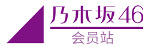

# ◢ Nogichu 
[](https://www.nogizaka46.com)
>仿[乃木坂46中国会员站](https://www.nogizaka46-cn.com)   
>Powered by [Node.js](https://nodejs.org) && [Express](https://expressjs.com)



移除原站点的会员支付、短信验证功能  


**注意：本项目仅供学习交流，严禁用于商业用途**

## 项目依赖
* Node.js v10
* MongoDB

## 安装依赖
```shell script
npm install
```

## 数据导入
```shell script
mongoimport -d nogi -c member --drop --jsonArray < ./data/members.json
mongoimport -d nogi -c photos --drop --jsonArray < ./data/member-photo.json
```

## 运行
```shell script
node app.js

浏览器访问:
http://localhost:3000
```

## 通过Docker运行
```shell script
docker-compose up
```

## Todo
* admin页面

## License
Licensed under The MIT License